# Projekt dot. Wskaźnika Szczęścia na Świecie
## Ranking z przedziału 2015-2019

## Autor: Filip Wałęga

# Przegląd Projektu
Celem tego projektu jest zbadanie i analiza Wskaźnika szczęścia na świecie. 


### Źródło danych: [kaggle.com](https://www.kaggle.com/datasets/unsdsn/world-happiness/)

### System operacyjny na którym pracuje: Ubuntu LTS - Linux


#### Importowanie i aliasowanie


```python
import numpy as np
import pandas as pd
import matplotlib.pyplot as plt
import seaborn as sns
import os 
```

#### Wczytanie danych i sprawdzenie poprawności wczytania


```python
data = pd.read_csv(os.path.join(os.curdir, 'data', '2015.csv'))
data.head()
```


<div>
<style scoped>
    .dataframe tbody tr th:only-of-type {
        vertical-align: middle;
    }

    .dataframe tbody tr th {
        vertical-align: top;
    }

    .dataframe thead th {
        text-align: right;
    }
</style>
<table border="1" class="dataframe">
  <thead>
    <tr style="text-align: right;">
      <th></th>
      <th>Country</th>
      <th>Region</th>
      <th>Happiness Rank</th>
      <th>Happiness Score</th>
      <th>Standard Error</th>
      <th>Economy (GDP per Capita)</th>
      <th>Family</th>
      <th>Health (Life Expectancy)</th>
      <th>Freedom</th>
      <th>Trust (Government Corruption)</th>
      <th>Generosity</th>
      <th>Dystopia Residual</th>
    </tr>
  </thead>
  <tbody>
    <tr>
      <th>0</th>
      <td>Switzerland</td>
      <td>Western Europe</td>
      <td>1</td>
      <td>7.587</td>
      <td>0.03411</td>
      <td>1.39651</td>
      <td>1.34951</td>
      <td>0.94143</td>
      <td>0.66557</td>
      <td>0.41978</td>
      <td>0.29678</td>
      <td>2.51738</td>
    </tr>
    <tr>
      <th>1</th>
      <td>Iceland</td>
      <td>Western Europe</td>
      <td>2</td>
      <td>7.561</td>
      <td>0.04884</td>
      <td>1.30232</td>
      <td>1.40223</td>
      <td>0.94784</td>
      <td>0.62877</td>
      <td>0.14145</td>
      <td>0.43630</td>
      <td>2.70201</td>
    </tr>
    <tr>
      <th>2</th>
      <td>Denmark</td>
      <td>Western Europe</td>
      <td>3</td>
      <td>7.527</td>
      <td>0.03328</td>
      <td>1.32548</td>
      <td>1.36058</td>
      <td>0.87464</td>
      <td>0.64938</td>
      <td>0.48357</td>
      <td>0.34139</td>
      <td>2.49204</td>
    </tr>
    <tr>
      <th>3</th>
      <td>Norway</td>
      <td>Western Europe</td>
      <td>4</td>
      <td>7.522</td>
      <td>0.03880</td>
      <td>1.45900</td>
      <td>1.33095</td>
      <td>0.88521</td>
      <td>0.66973</td>
      <td>0.36503</td>
      <td>0.34699</td>
      <td>2.46531</td>
    </tr>
    <tr>
      <th>4</th>
      <td>Canada</td>
      <td>North America</td>
      <td>5</td>
      <td>7.427</td>
      <td>0.03553</td>
      <td>1.32629</td>
      <td>1.32261</td>
      <td>0.90563</td>
      <td>0.63297</td>
      <td>0.32957</td>
      <td>0.45811</td>
      <td>2.45176</td>
    </tr>
  </tbody>
</table>
</div>


#### Podstawowa analiza, żeby zobaczyć jak wyglądają dane ogólnie


```python
data.describe()
```


<div>
<style scoped>
    .dataframe tbody tr th:only-of-type {
        vertical-align: middle;
    }

    .dataframe tbody tr th {
        vertical-align: top;
    }

    .dataframe thead th {
        text-align: right;
    }
</style>
<table border="1" class="dataframe">
  <thead>
    <tr style="text-align: right;">
      <th></th>
      <th>Happiness Rank</th>
      <th>Happiness Score</th>
      <th>Standard Error</th>
      <th>Economy (GDP per Capita)</th>
      <th>Family</th>
      <th>Health (Life Expectancy)</th>
      <th>Freedom</th>
      <th>Trust (Government Corruption)</th>
      <th>Generosity</th>
      <th>Dystopia Residual</th>
    </tr>
  </thead>
  <tbody>
    <tr>
      <th>count</th>
      <td>158.000000</td>
      <td>158.000000</td>
      <td>158.000000</td>
      <td>158.000000</td>
      <td>158.000000</td>
      <td>158.000000</td>
      <td>158.000000</td>
      <td>158.000000</td>
      <td>158.000000</td>
      <td>158.000000</td>
    </tr>
    <tr>
      <th>mean</th>
      <td>79.493671</td>
      <td>5.375734</td>
      <td>0.047885</td>
      <td>0.846137</td>
      <td>0.991046</td>
      <td>0.630259</td>
      <td>0.428615</td>
      <td>0.143422</td>
      <td>0.237296</td>
      <td>2.098977</td>
    </tr>
    <tr>
      <th>std</th>
      <td>45.754363</td>
      <td>1.145010</td>
      <td>0.017146</td>
      <td>0.403121</td>
      <td>0.272369</td>
      <td>0.247078</td>
      <td>0.150693</td>
      <td>0.120034</td>
      <td>0.126685</td>
      <td>0.553550</td>
    </tr>
    <tr>
      <th>min</th>
      <td>1.000000</td>
      <td>2.839000</td>
      <td>0.018480</td>
      <td>0.000000</td>
      <td>0.000000</td>
      <td>0.000000</td>
      <td>0.000000</td>
      <td>0.000000</td>
      <td>0.000000</td>
      <td>0.328580</td>
    </tr>
    <tr>
      <th>25%</th>
      <td>40.250000</td>
      <td>4.526000</td>
      <td>0.037268</td>
      <td>0.545808</td>
      <td>0.856823</td>
      <td>0.439185</td>
      <td>0.328330</td>
      <td>0.061675</td>
      <td>0.150553</td>
      <td>1.759410</td>
    </tr>
    <tr>
      <th>50%</th>
      <td>79.500000</td>
      <td>5.232500</td>
      <td>0.043940</td>
      <td>0.910245</td>
      <td>1.029510</td>
      <td>0.696705</td>
      <td>0.435515</td>
      <td>0.107220</td>
      <td>0.216130</td>
      <td>2.095415</td>
    </tr>
    <tr>
      <th>75%</th>
      <td>118.750000</td>
      <td>6.243750</td>
      <td>0.052300</td>
      <td>1.158448</td>
      <td>1.214405</td>
      <td>0.811013</td>
      <td>0.549092</td>
      <td>0.180255</td>
      <td>0.309883</td>
      <td>2.462415</td>
    </tr>
    <tr>
      <th>max</th>
      <td>158.000000</td>
      <td>7.587000</td>
      <td>0.136930</td>
      <td>1.690420</td>
      <td>1.402230</td>
      <td>1.025250</td>
      <td>0.669730</td>
      <td>0.551910</td>
      <td>0.795880</td>
      <td>3.602140</td>
    </tr>
  </tbody>
</table>
</div>


#### Sprawdzenie NULL | NAN | NA


```python
data.info()
```

    <class 'pandas.core.frame.DataFrame'>
    RangeIndex: 158 entries, 0 to 157
    Data columns (total 12 columns):
     #   Column                         Non-Null Count  Dtype  
    ---  ------                         --------------  -----  
     0   Country                        158 non-null    object 
     1   Region                         158 non-null    object 
     2   Happiness Rank                 158 non-null    int64  
     3   Happiness Score                158 non-null    float64
     4   Standard Error                 158 non-null    float64
     5   Economy (GDP per Capita)       158 non-null    float64
     6   Family                         158 non-null    float64
     7   Health (Life Expectancy)       158 non-null    float64
     8   Freedom                        158 non-null    float64
     9   Trust (Government Corruption)  158 non-null    float64
     10  Generosity                     158 non-null    float64
     11  Dystopia Residual              158 non-null    float64
    dtypes: float64(9), int64(1), object(2)
    memory usage: 14.9+ KB


#### Jeszcze spójrzmy na typy danych


```python
data.dtypes
```


    Country                           object
    Region                            object
    Happiness Rank                     int64
    Happiness Score                  float64
    Standard Error                   float64
    Economy (GDP per Capita)         float64
    Family                           float64
    Health (Life Expectancy)         float64
    Freedom                          float64
    Trust (Government Corruption)    float64
    Generosity                       float64
    Dystopia Residual                float64
    dtype: object


#### Sprawdźmy czy napewno nie ma jakiegoś NA


```python
data[data.isna()].dropna()
```


<div>
<style scoped>
    .dataframe tbody tr th:only-of-type {
        vertical-align: middle;
    }

    .dataframe tbody tr th {
        vertical-align: top;
    }

    .dataframe thead th {
        text-align: right;
    }
</style>
<table border="1" class="dataframe">
  <thead>
    <tr style="text-align: right;">
      <th></th>
      <th>Country</th>
      <th>Region</th>
      <th>Happiness Rank</th>
      <th>Happiness Score</th>
      <th>Standard Error</th>
      <th>Economy (GDP per Capita)</th>
      <th>Family</th>
      <th>Health (Life Expectancy)</th>
      <th>Freedom</th>
      <th>Trust (Government Corruption)</th>
      <th>Generosity</th>
      <th>Dystopia Residual</th>
    </tr>
  </thead>
  <tbody>
  </tbody>
</table>
</div>


#### Wygląda na to, że nasze dane są bardzo dobrze uzupełnione
#### Jedyne co trzeba było zrobić to poprawić nazwy kolumn pomiędzy latami
#### Zrobiłem to ręcznie, ponieważ tak było najprościej, a po co komplikować?


## Analiza wykresów


```python
plt.scatter(data['Economy (GDP per Capita)'], data['Happiness Score'])
plt.xlabel('Ekonomia (GDP per Capita)')
plt.ylabel('Wskaźnik Szczęścia')
plt.title('Wynik Sczęścia vs GDP per Capita')
plt.show()
```


    
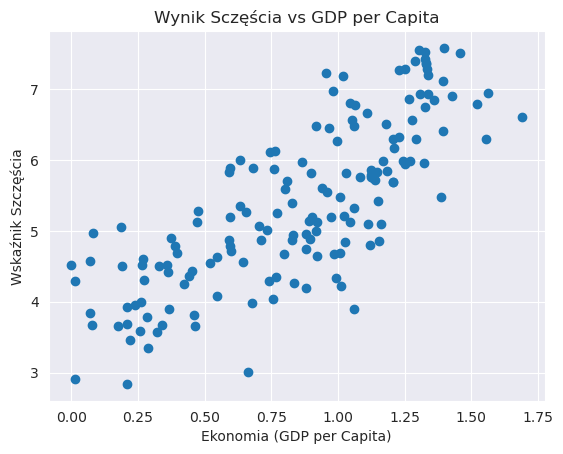
    


```python
# Average happiness score by region
region_grouped = data.groupby('Region')['Happiness Score'].mean().sort_values(ascending=False)
region_grouped.plot(kind='bar', figsize=(10,5))
plt.ylabel('Średni Wskaźnik Szczęścia')
plt.title('Średni Wskaźnik Szczęścia ze wzgl na Region')
plt.show()

```


    
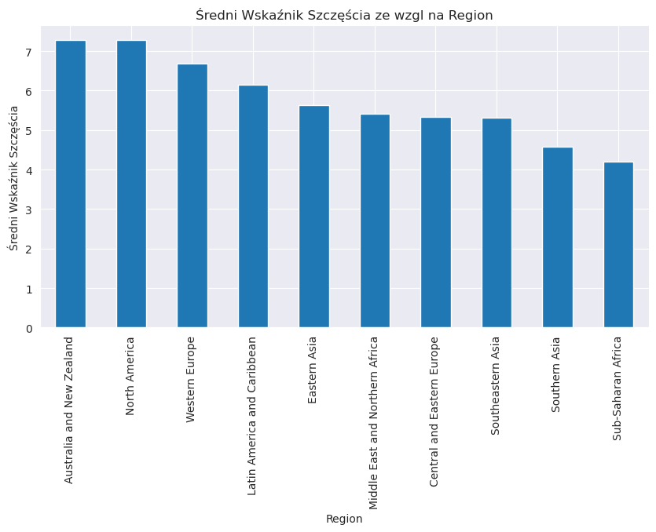
    


```python
numerical_data = data.select_dtypes(include=['int64', 'float64'])
correlation_matrix = numerical_data.corr()
sns.heatmap(correlation_matrix, annot=True, cmap='coolwarm')
plt.title('Macierz korelacji Numerycznych Kolumn')
plt.show()

```


    
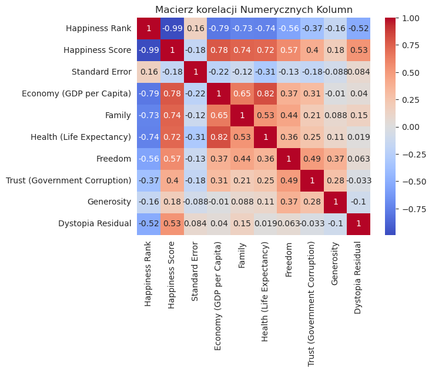
    


```python
sns.boxplot(x=data['Happiness Score'])
```


    <Axes: xlabel='Happiness Score'>


    
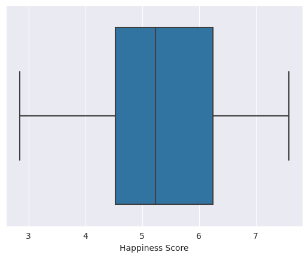
    


#### Teraz wczytajmy dane z wszystkich lat do listy


```python

datasets = []
for i in range(2015, 2020):
    datasets.append(pd.read_csv(os.path.join(os.curdir, "data", f"{i}.csv")))
for i, dataset in enumerate(datasets):
    year = 2015 + i
    dataset['Year'] = year

```

#### Sprawdźmy czy się wczytało


```python
print(datasets[4])
```

         Happiness Rank                   Country  Happiness Score  \
    0                 1                   Finland            7.769   
    1                 2                   Denmark            7.600   
    2                 3                    Norway            7.554   
    3                 4                   Iceland            7.494   
    4                 5               Netherlands            7.488   
    ..              ...                       ...              ...   
    151             152                    Rwanda            3.334   
    152             153                  Tanzania            3.231   
    153             154               Afghanistan            3.203   
    154             155  Central African Republic            3.083   
    155             156               South Sudan            2.853   
    
         Economy (GDP per Capita)  Family  Health (Life Expectancy)  Freedom  \
    0                       1.340   1.587                     0.986    0.596   
    1                       1.383   1.573                     0.996    0.592   
    2                       1.488   1.582                     1.028    0.603   
    3                       1.380   1.624                     1.026    0.591   
    4                       1.396   1.522                     0.999    0.557   
    ..                        ...     ...                       ...      ...   
    151                     0.359   0.711                     0.614    0.555   
    152                     0.476   0.885                     0.499    0.417   
    153                     0.350   0.517                     0.361    0.000   
    154                     0.026   0.000                     0.105    0.225   
    155                     0.306   0.575                     0.295    0.010   
    
         Generosity  Trust (Government Corruption)  Year  
    0         0.153                          0.393  2019  
    1         0.252                          0.410  2019  
    2         0.271                          0.341  2019  
    3         0.354                          0.118  2019  
    4         0.322                          0.298  2019  
    ..          ...                            ...   ...  
    151       0.217                          0.411  2019  
    152       0.276                          0.147  2019  
    153       0.158                          0.025  2019  
    154       0.235                          0.035  2019  
    155       0.202                          0.091  2019  
    
    [156 rows x 10 columns]


#### Połączymy to wszystko w jeden zbiór i sprawdzimy czy wszystko jest okej


```python
combined_data = pd.concat(datasets, ignore_index=True)
combined_data.info()
```

    <class 'pandas.core.frame.DataFrame'>
    RangeIndex: 782 entries, 0 to 781
    Data columns (total 17 columns):
     #   Column                         Non-Null Count  Dtype  
    ---  ------                         --------------  -----  
     0   Country                        782 non-null    object 
     1   Region                         315 non-null    object 
     2   Happiness Rank                 782 non-null    int64  
     3   Happiness Score                782 non-null    float64
     4   Standard Error                 158 non-null    float64
     5   Economy (GDP per Capita)       782 non-null    float64
     6   Family                         782 non-null    float64
     7   Health (Life Expectancy)       782 non-null    float64
     8   Freedom                        782 non-null    float64
     9   Trust (Government Corruption)  781 non-null    float64
     10  Generosity                     782 non-null    float64
     11  Dystopia Residual              470 non-null    float64
     12  Year                           782 non-null    int64  
     13  Lower Confidence Interval      157 non-null    float64
     14  Upper Confidence Interval      157 non-null    float64
     15  Whisker high                   155 non-null    float64
     16  Whisker low                    155 non-null    float64
    dtypes: float64(13), int64(2), object(2)
    memory usage: 104.0+ KB


#### Czas na wykresy


```python
average_happiness_per_year = combined_data.groupby('Year')['Happiness Score'].mean()
average_happiness_per_year.plot(kind='line')
plt.title('Średni wskaźnik szczęścia przez lata 2015-2019')
plt.ylabel('Średni wynik szczęścia')
plt.xlabel('Rok')
plt.xticks([year for year in range(2015, 2020)])
plt.show()

```


    
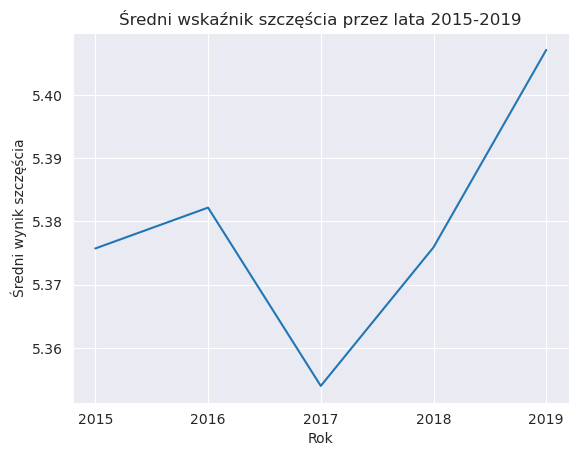
    


## Zmiana pozycji krajów w rankingu na przestrzeni lat


```python
happiness_rank_change = combined_data.pivot(index='Country', columns='Year', values='Happiness Rank')
happiness_rank_change['Rank Change'] = happiness_rank_change[2019] - happiness_rank_change[2015]
happiness_rank_change['Rank Change'].sort_values().dropna().plot(kind='bar', figsize=(23,6))
plt.title('Zmiany w Rankingu Szczęścia od 2015 do 2019')
plt.ylabel('Zmiana miejsca')
plt.xlabel('Kraj')
plt.show()

```


    
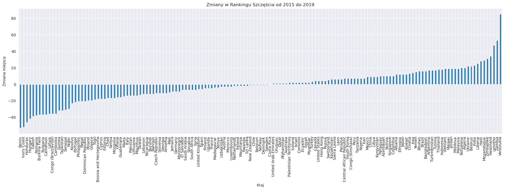
    


#### Sprawdźmy od czego najbardziej zależą dane wyniki
zwróćmy uwagę na wiersz lub kolumne z Happiness Score


```python
for year in range(2015, 2020):
    year_data = combined_data[combined_data['Year'] == year]
    correlation_matrix = numerical_data = year_data.select_dtypes(include=['int64', 'float64']).corr()
    plt.figure(figsize=(10, 8))
    sns.heatmap(correlation_matrix, annot=True)
    plt.title(f'Macierz Korelacji dla {year}')
    plt.show()

```


    
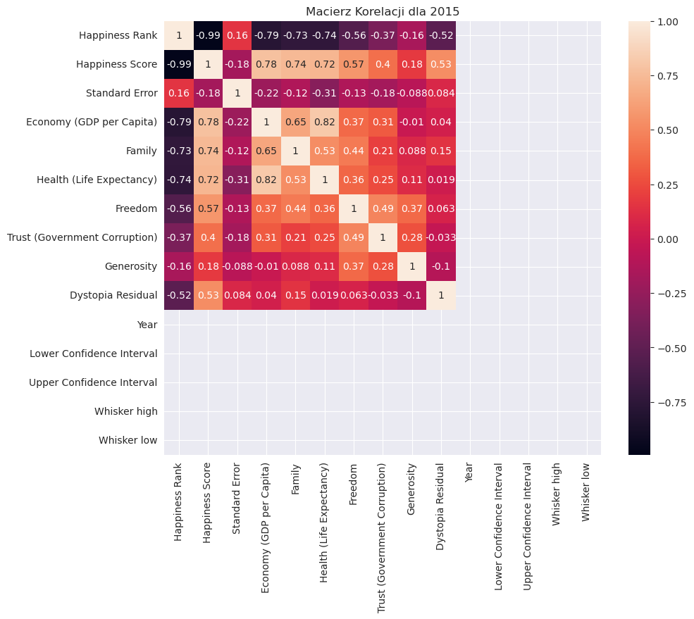
    


    
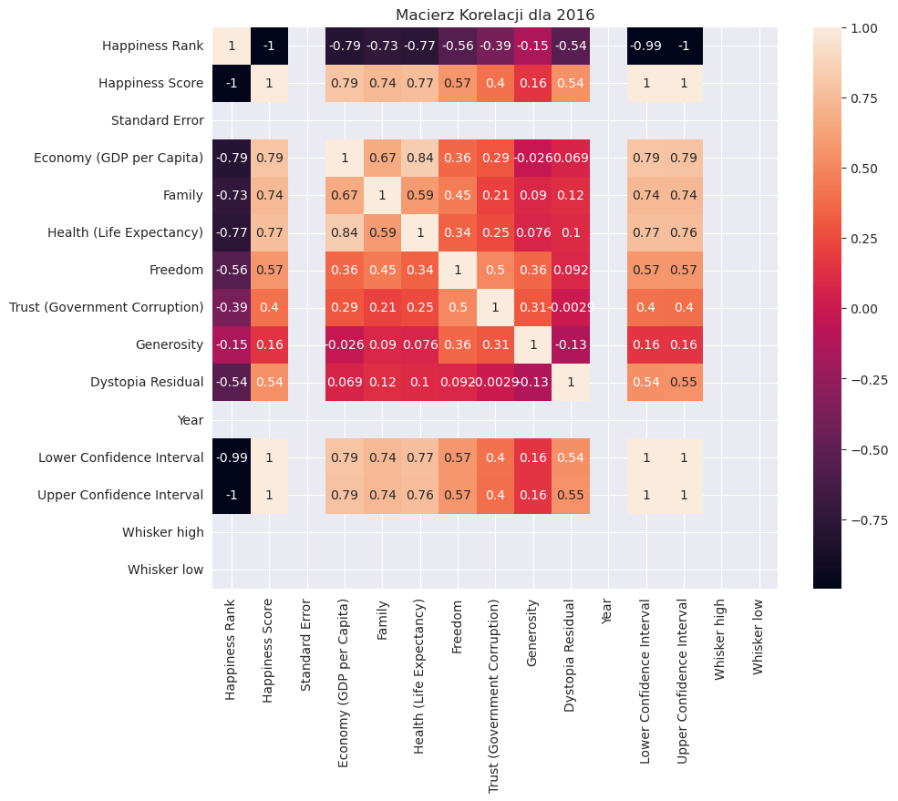
    


    
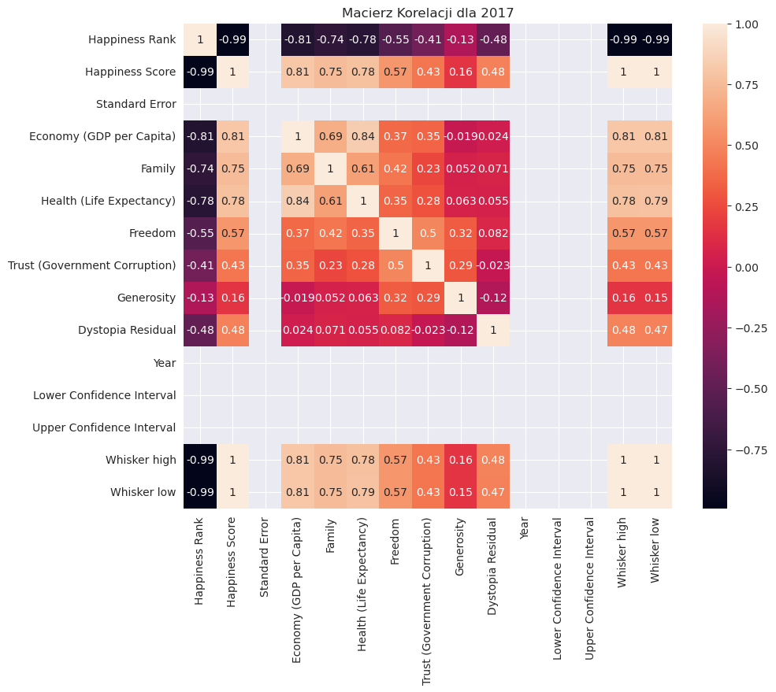
    


    
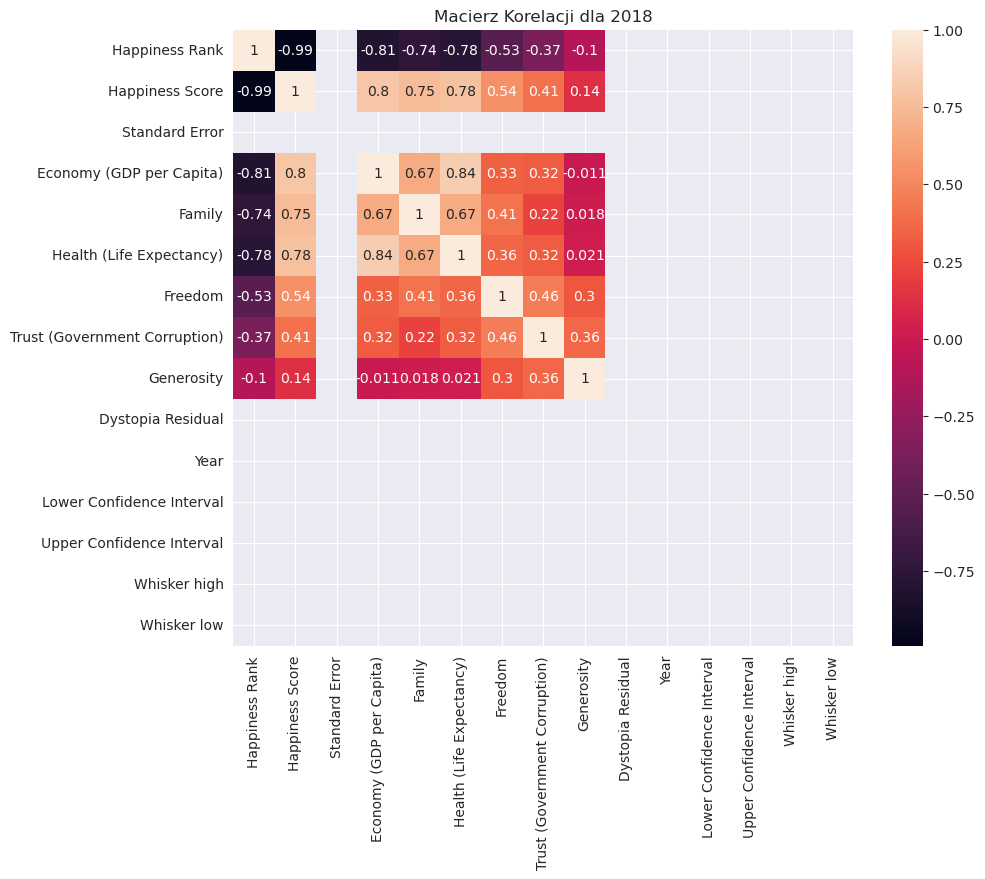
    


    
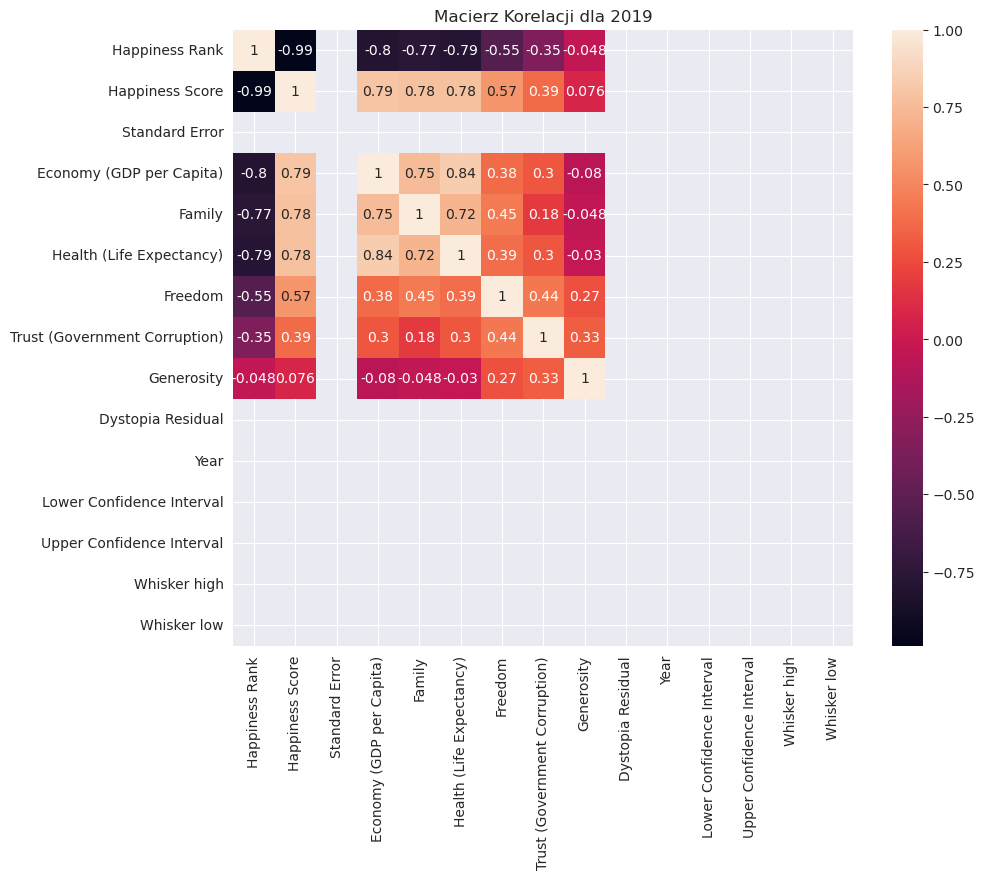
    


```python
sns.boxplot(y=combined_data['Happiness Score'], x=combined_data['Year'])
```


    <Axes: xlabel='Year', ylabel='Happiness Score'>


    
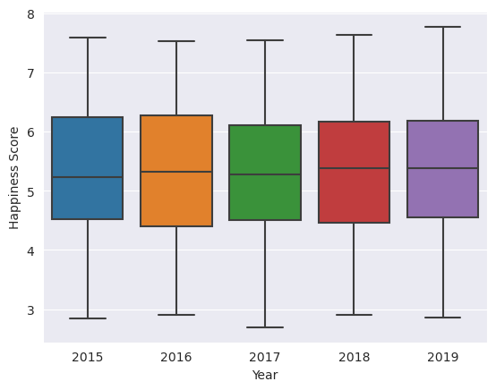
    


```python
sns.boxplot(y=combined_data['Trust (Government Corruption)'], x=combined_data['Year'])
```


    <Axes: xlabel='Year', ylabel='Trust (Government Corruption)'>


    
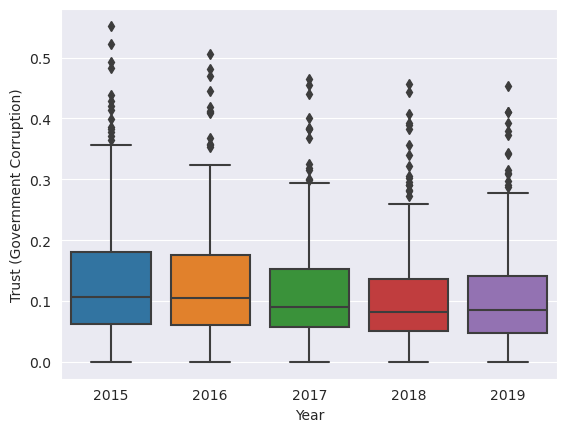
    


```python
sns.boxplot(y=combined_data['Family'], x=combined_data['Year'])
```


    <Axes: xlabel='Year', ylabel='Family'>


    
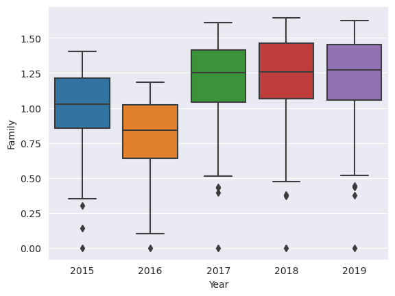
    


```python
sns.boxplot(y=combined_data['Economy (GDP per Capita)'], x=combined_data['Year'])
```


    <Axes: xlabel='Year', ylabel='Economy (GDP per Capita)'>


    
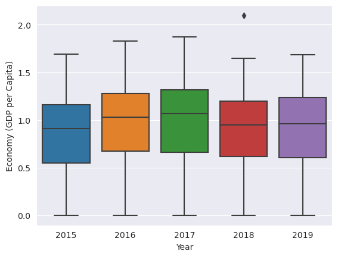
    


```python
sns.scatterplot(x=combined_data['Happiness Score'], y=combined_data['Economy (GDP per Capita)'])
```


    <Axes: xlabel='Happiness Score', ylabel='Economy (GDP per Capita)'>


    
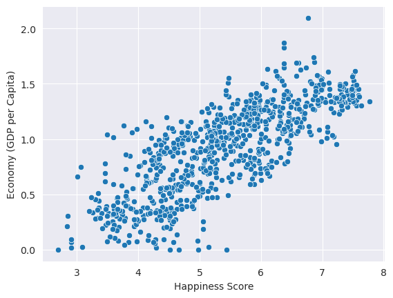
    


```python
sns.scatterplot(x=combined_data['Happiness Score'], y=combined_data['Trust (Government Corruption)'])
```


    <Axes: xlabel='Happiness Score', ylabel='Trust (Government Corruption)'>


    
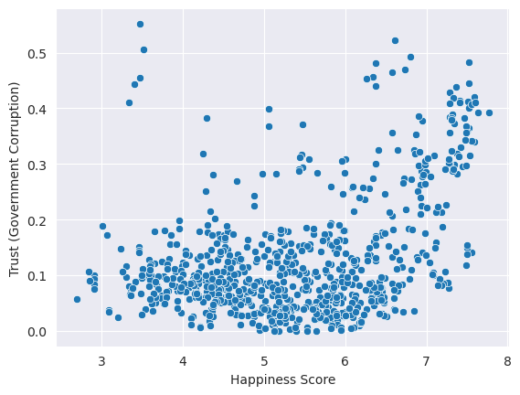
    


```python
sns.scatterplot(x=combined_data['Happiness Score'], y=combined_data['Health (Life Expectancy)'])
```


    <Axes: xlabel='Happiness Score', ylabel='Health (Life Expectancy)'>


    
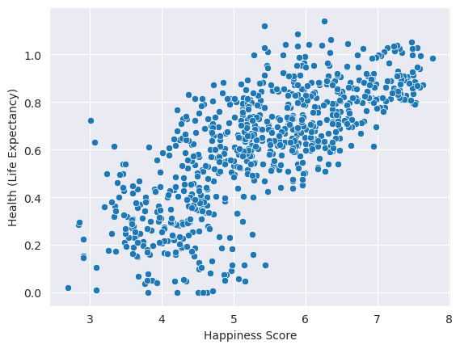
    


```python
sns.scatterplot(x=combined_data['Happiness Score'], y=combined_data['Family'])
```


    <Axes: xlabel='Happiness Score', ylabel='Family'>


    
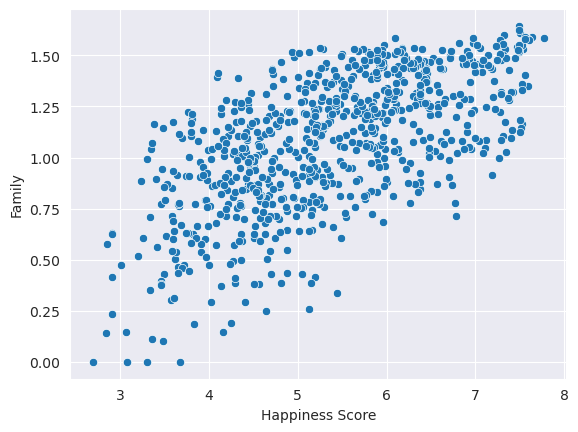
    


## TOP 1 Wskaźników Szczęścia na świecie w danym roku


```python
most_happy_countries = combined_data.loc[combined_data.groupby('Year')['Happiness Score'].idxmax()]
print(most_happy_countries[['Year', 'Country', 'Happiness Score']])

```

         Year      Country  Happiness Score
    0    2015  Switzerland            7.587
    158  2016      Denmark            7.526
    315  2017       Norway            7.537
    470  2018      Finland            7.632
    626  2019      Finland            7.769


## TOP 5 Wskaźników Szczęścia na świecie w danym roku


```python
most_happy_countries = combined_data.loc[combined_data.groupby('Year')['Happiness Score'].nlargest(5).reset_index()["level_1"]].reset_index()
num = 0
print("TOP 5 'Happiness Score' Krajów w danym roku")
for row in most_happy_countries.itertuples():
    if (num%5) == 0:
        print(f"ROK {row[14]}")
    print(f"{num%5+1} - {row[2]} - {round(row[5], 3)}")
    num +=1
```

    TOP 5 'Happiness Score' Krajów w danym roku
    ROK 2015
    1 - Switzerland - 7.587
    2 - Iceland - 7.561
    3 - Denmark - 7.527
    4 - Norway - 7.522
    5 - Canada - 7.427
    ROK 2016
    1 - Denmark - 7.526
    2 - Switzerland - 7.509
    3 - Iceland - 7.501
    4 - Norway - 7.498
    5 - Finland - 7.413
    ROK 2017
    1 - Norway - 7.537
    2 - Denmark - 7.522
    3 - Iceland - 7.504
    4 - Switzerland - 7.494
    5 - Finland - 7.469
    ROK 2018
    1 - Finland - 7.632
    2 - Norway - 7.594
    3 - Denmark - 7.555
    4 - Iceland - 7.495
    5 - Switzerland - 7.487
    ROK 2019
    1 - Finland - 7.769
    2 - Denmark - 7.6
    3 - Norway - 7.554
    4 - Iceland - 7.494
    5 - Netherlands - 7.488


## Odwrotny TOP 5 Wskaźników Szczęścia na świecie w danym roku


```python
most_happy_countries = combined_data.loc[combined_data.groupby('Year')['Happiness Score'].nsmallest(5).reset_index()["level_1"]].reset_index()
num = 0
print("Odwrotny TOP 5 'Happiness Score' Krajów w danym roku")
for row in most_happy_countries.itertuples():
    if (num%5) == 0:
        print(f"ROK {row[14]}")
    print(f"{num%5+1} - {row[2]} - {round(row[5], 3)}")
    num +=1
```

    Odwrotny TOP 5 'Happiness Score' Krajów w danym roku
    ROK 2015
    1 - Togo - 2.839
    2 - Burundi - 2.905
    3 - Syria - 3.006
    4 - Benin - 3.34
    5 - Rwanda - 3.465
    ROK 2016
    1 - Burundi - 2.905
    2 - Syria - 3.069
    3 - Togo - 3.303
    4 - Afghanistan - 3.36
    5 - Benin - 3.484
    ROK 2017
    1 - Central African Republic - 2.693
    2 - Burundi - 2.905
    3 - Tanzania - 3.349
    4 - Syria - 3.462
    5 - Rwanda - 3.471
    ROK 2018
    1 - Burundi - 2.905
    2 - Central African Republic - 3.083
    3 - South Sudan - 3.254
    4 - Tanzania - 3.303
    5 - Yemen - 3.355
    ROK 2019
    1 - South Sudan - 2.853
    2 - Central African Republic - 3.083
    3 - Afghanistan - 3.203
    4 - Tanzania - 3.231
    5 - Rwanda - 3.334


## Sprawdźmy jak się ma Polska
#### Wyswietle Finlandie dla porównania

#### 2015


```python
data = pd.read_csv(os.path.join(os.curdir, "data", "2015.csv"))
```


```python
data.sort_values("Happiness Score").where(data['Country'] == "Poland").dropna(axis=0, how='any')
```


<div>
<style scoped>
    .dataframe tbody tr th:only-of-type {
        vertical-align: middle;
    }

    .dataframe tbody tr th {
        vertical-align: top;
    }

    .dataframe thead th {
        text-align: right;
    }
</style>
<table border="1" class="dataframe">
  <thead>
    <tr style="text-align: right;">
      <th></th>
      <th>Country</th>
      <th>Region</th>
      <th>Happiness Rank</th>
      <th>Happiness Score</th>
      <th>Standard Error</th>
      <th>Economy (GDP per Capita)</th>
      <th>Family</th>
      <th>Health (Life Expectancy)</th>
      <th>Freedom</th>
      <th>Trust (Government Corruption)</th>
      <th>Generosity</th>
      <th>Dystopia Residual</th>
    </tr>
  </thead>
  <tbody>
    <tr>
      <th>59</th>
      <td>Poland</td>
      <td>Central and Eastern Europe</td>
      <td>60.0</td>
      <td>5.791</td>
      <td>0.04263</td>
      <td>1.12555</td>
      <td>1.27948</td>
      <td>0.77903</td>
      <td>0.53122</td>
      <td>0.04212</td>
      <td>0.16759</td>
      <td>1.86565</td>
    </tr>
  </tbody>
</table>
</div>


```python
data.sort_values("Happiness Score").where(data['Country'] == "Finland").dropna(axis=0, how='any')

```


<div>
<style scoped>
    .dataframe tbody tr th:only-of-type {
        vertical-align: middle;
    }

    .dataframe tbody tr th {
        vertical-align: top;
    }

    .dataframe thead th {
        text-align: right;
    }
</style>
<table border="1" class="dataframe">
  <thead>
    <tr style="text-align: right;">
      <th></th>
      <th>Country</th>
      <th>Region</th>
      <th>Happiness Rank</th>
      <th>Happiness Score</th>
      <th>Standard Error</th>
      <th>Economy (GDP per Capita)</th>
      <th>Family</th>
      <th>Health (Life Expectancy)</th>
      <th>Freedom</th>
      <th>Trust (Government Corruption)</th>
      <th>Generosity</th>
      <th>Dystopia Residual</th>
    </tr>
  </thead>
  <tbody>
    <tr>
      <th>5</th>
      <td>Finland</td>
      <td>Western Europe</td>
      <td>6.0</td>
      <td>7.406</td>
      <td>0.0314</td>
      <td>1.29025</td>
      <td>1.31826</td>
      <td>0.88911</td>
      <td>0.64169</td>
      <td>0.41372</td>
      <td>0.23351</td>
      <td>2.61955</td>
    </tr>
  </tbody>
</table>
</div>


#### 2019


```python
data = pd.read_csv(os.path.join(os.curdir, "data", "2019.csv"))
```


```python
data.sort_values("Happiness Score").where(data['Country'] == "Poland").dropna(axis=0, how='any')
```


<div>
<style scoped>
    .dataframe tbody tr th:only-of-type {
        vertical-align: middle;
    }

    .dataframe tbody tr th {
        vertical-align: top;
    }

    .dataframe thead th {
        text-align: right;
    }
</style>
<table border="1" class="dataframe">
  <thead>
    <tr style="text-align: right;">
      <th></th>
      <th>Happiness Rank</th>
      <th>Country</th>
      <th>Happiness Score</th>
      <th>Economy (GDP per Capita)</th>
      <th>Family</th>
      <th>Health (Life Expectancy)</th>
      <th>Freedom</th>
      <th>Generosity</th>
      <th>Trust (Government Corruption)</th>
    </tr>
  </thead>
  <tbody>
    <tr>
      <th>39</th>
      <td>40.0</td>
      <td>Poland</td>
      <td>6.182</td>
      <td>1.206</td>
      <td>1.438</td>
      <td>0.884</td>
      <td>0.483</td>
      <td>0.117</td>
      <td>0.05</td>
    </tr>
  </tbody>
</table>
</div>


```python
data.sort_values("Happiness Score").where(data['Country'] == "Finland").dropna(axis=0, how='any')
```


<div>
<style scoped>
    .dataframe tbody tr th:only-of-type {
        vertical-align: middle;
    }

    .dataframe tbody tr th {
        vertical-align: top;
    }

    .dataframe thead th {
        text-align: right;
    }
</style>
<table border="1" class="dataframe">
  <thead>
    <tr style="text-align: right;">
      <th></th>
      <th>Happiness Rank</th>
      <th>Country</th>
      <th>Happiness Score</th>
      <th>Economy (GDP per Capita)</th>
      <th>Family</th>
      <th>Health (Life Expectancy)</th>
      <th>Freedom</th>
      <th>Generosity</th>
      <th>Trust (Government Corruption)</th>
    </tr>
  </thead>
  <tbody>
    <tr>
      <th>0</th>
      <td>1.0</td>
      <td>Finland</td>
      <td>7.769</td>
      <td>1.34</td>
      <td>1.587</td>
      <td>0.986</td>
      <td>0.596</td>
      <td>0.153</td>
      <td>0.393</td>
    </tr>
  </tbody>
</table>
</div>


## Końcowe wnioski
- możemy zauważyć pewien rodzaj liniowości na wykresach (nie wszystkich)
- większość top 5 wskaźników zajmują kraję w których jest duży(nie największy) wskaźnik depresji 
- Polska nie ma się źle i jest coraz lepiej
- Rodziny gdzie jest więcej dzieci zazwyczaj są szczęśliwsze


```python

```


